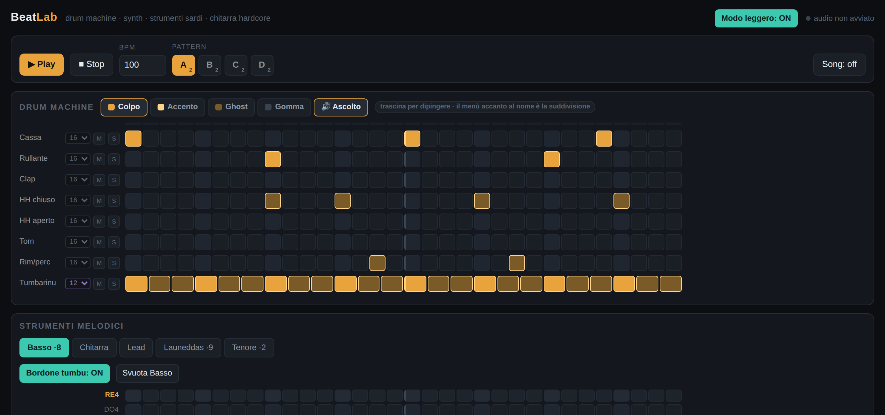
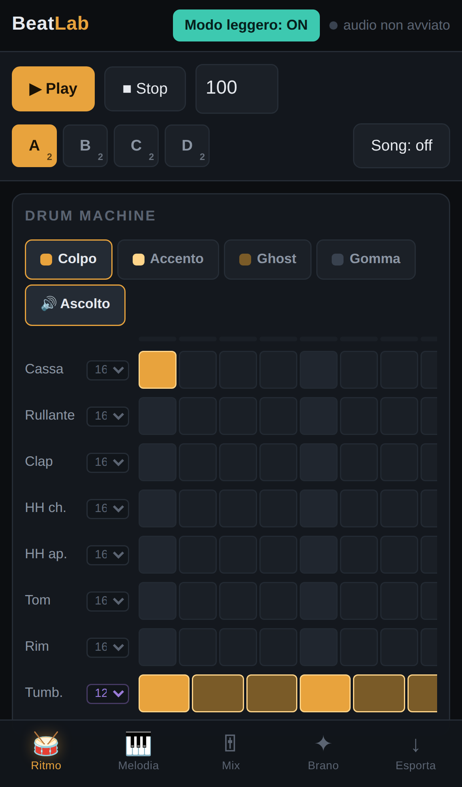

# BeatLab

Drum machine e synth nel browser, con un'anima sarda. Nessun sample: cassa,
launeddas, chitarra hardcore — ogni suono è sintetizzato in tempo reale con la
Web Audio API.

**▶ Prova subito: <https://ergologica.github.io/beatlab/>**

Si installa come app (menu del browser → *Installa BeatLab*) e da lì funziona
anche offline.



Sul telefono l'interfaccia si riorganizza in cinque schede — Ritmo, Melodia,
Mix, Brano, File — con il trasporto sempre fermo in alto e la navigazione
nella zona del pollice. La colonna dei nomi resta ferma mentre la griglia
scorre di lato, e le celle crescono per stare comode sotto il dito.



## Cosa fa

- **Drum machine** a 8 tracce — cassa, rullante, clap, due hi-hat (il chiuso
  strozza l'aperto), tom, rim, **tumbarinu** (tamburo a cornice sardo, modi di
  membrana inarmonici + ronzio del cordino). Si disegna trascinando, con mouse
  o dita; pennello a quattro stati (colpo / accento / ghost / gomma).
- **Suddivisione per traccia**: 8, 12, 16 o 24 passi per battuta — 12 e 24 sono
  terzine vere, così il tumbarinu va in 12/8 sopra il 4/4.
- **5 strumenti melodici** su griglia vincolata alla scala: basso saturo,
  chitarra power chord con palm mute, synth lead, **launeddas** (monofoniche e
  legate: l'articolazione è un calo d'ampiezza, non un silenzio) e **canto a
  tenore** (raddoppio di periodo + formanti). Più il **bordone tumbu**
  attivabile per pattern.
- **Generatore di pattern** in cinque stili — boom bap, breakbeat hiphop,
  d-beat hardcore, ethno sardo, trap — con progressioni estratte dal modo
  scelto. Ogni generazione ha un **seed** riproducibile; **Variazione** crea
  una sezione B credibile dal pattern corrente.
- **Song mode**: 4 slot di pattern con lunghezze indipendenti + una catena
  (`AABA`, `AABACD`…).
- **Mix**: mixer per traccia, sidechain sulla cassa, due riverberi a
  convoluzione, bitcrush + riduzione di sample rate sul bus batteria,
  umanizzazione deterministica di tempo e dinamica.
- **Export**: MP3, WAV, **MIDI** (tipo 1, 480 PPQ, batteria General MIDI sul
  canale 10 — aprilo nel tuo DAW), JSON. Undo/redo a 60 passi e salvataggio
  automatico nel browser.
- **Condivisione con un link**: il tasto *Condividi* copia un indirizzo che
  contiene l'intero progetto compresso nel frammento dell'URL. Chi lo apre se
  lo trova già caricato e modificabile — nessun archivio da nessuna parte, e
  il frammento non viaggia nemmeno verso il server.
- **Audizione mentre disegni**: ogni colpo e ogni nota si sentono nel momento
  in cui li metti, anche a trasporto fermo. Si spegne dal pennello *Ascolto*.
- **Estrazione da un video**: la scheda *File* compone il comando che scarica
  un pezzo, ne **separa la voce dalla base**, ne misura il tempo e ne trascrive
  la batteria in un pattern già suonabile. Poi la voce estratta si ricarica
  nella app e si sente **sopra il tuo beat**, per capire se regge sotto
  qualcuno che canta. Dettagli sotto, in [Dal video al pattern](#dal-video-al-pattern).
- **Modo leggero**, acceso da solo su telefoni e macchine modeste: voci con
  meno oscillatori e riverberi a rete di ritardi invece che a convoluzione.
  L'interruttore è in alto a destra. L'export resta sempre a qualità piena.

## Prestazioni

Il motore riusa le voci invece di crearle a ogni colpo: gli oscillatori di
cassa, rullante, hi-hat, tumbarinu, basso e chitarra restano accesi e ogni nota
riprogramma solo inviluppi e frequenze. Le catene fisse — cabinet, formanti,
filtri — sono costruite una volta e condivise. Lo scheduler batte in un Web
Worker, così i timer rallentati dal browser non aprono buchi nell'audio.

Misurato su un render offline di un pattern fitto (batteria a sedicesimi,
tumbarinu in 12/8, chitarra a ottavi, bordone):

| | prima | ora |
|---|---|---|
| modo pieno | 0,7× tempo reale | **6,2×** |
| modo leggero | — | **11,4×** |

Sotto 1× il telefono non sta dietro: era quello il problema.

## Il motore Python

In [`py/beatlab_render.py`](py/beatlab_render.py) c'è un renderer offline ad
alta qualità che legge il JSON esportato dalla app: oscillatori a banda
limitata (niente aliasing), filtri biquad RBJ, riverbero a convoluzione FFT,
stem separati, export MIDI.

```bash
pip install numpy scipy

python3 py/beatlab_render.py examples/demo-pattern.json -o beat.mp3
python3 py/beatlab_render.py pattern.json -o beat.wav --sr 48000 --chain AABACD
python3 py/beatlab_render.py pattern.json -o beat.flac --repeat 4 --stems
python3 py/beatlab_render.py pattern.json --midi-only --midi beat.mid
python3 py/beatlab_render.py pattern.json -o gm.mp3 --sf2 FluidR3_GM.sf2
```

`--sf2` suona il MIDI del progetto con un SoundFont via FluidSynth
(`apt install fluidsynth`): non è il suono di BeatLab ma General MIDI di buona
fattura — utile per sentire l'arrangiamento con timbri classici. Banchi
consigliati: GeneralUser GS, FluidR3_GM.

L'estensione decide il formato (`.wav` nativo; `.mp3`/`.flac`/`.ogg` via
ffmpeg). L'anteprima del browser e il render Python condividono i **dati**, non
il suono: il browser è la bozza, Python il master.

## Dal video al pattern

[`py/beatlab_extract.py`](py/beatlab_extract.py) prende un link (o un file
audio) e restituisce una cartella di lavoro: le tracce separate, un progetto
BeatLab già suonabile e, se le chiedi, le fette da campionare.

```bash
pip install yt-dlp demucs          # oltre a numpy e scipy; serve ffmpeg

python3 py/beatlab_extract.py "https://www.youtube.com/watch?v=…" -o estratto
python3 py/beatlab_extract.py URL --two-stems --start 1:12 --duration 30
python3 py/beatlab_extract.py brano.wav --no-separate --slices hits
```

```
estratto/
  originale.wav     l'audio così com'era
  voce.wav          la voce sola
  base.wav          tutto tranne la voce            (--two-stems)
  batteria.wav basso.wav altro.wav                  (separazione a quattro)
  progetto.json     BPM, swing e pattern: si carica da File → Carica progetto.json
  fette/            battuta-01.wav… oppure colpo-001.wav…
  estrazione.md     cosa ha trovato, e con quanta sicurezza
```

Il lavoro pesante non può stare nel browser — yt-dlp e il modello di
separazione pesano centinaia di megabyte — e la app vive su GitHub Pages, che
serve file e basta. Perciò la scheda *File* fa due cose: **scrive il comando**
con le opzioni scelte (basta copiarlo) e **rilegge quello che ne esce**, il
`progetto.json` e la voce.

La voce caricata diventa una **traccia di riferimento**: parte insieme al Play,
ha volume e scarto in millisecondi, esce dritta all'uscita senza passare per
master, riverberi e sidechain, e **non entra né nell'export né negli stem**. È
un metro, non un ingrediente. La prova che sia davvero così è nella suite.

### Dal telefono

Metà sì. Il pannello funziona: si incolla il link, si scelgono le opzioni, e il
tasto **↗ Invia** manda il comando dove lo si vuole — messaggio, note, posta —
per ritrovarlo al computer. Quello che il telefono **non** può fare è eseguirlo:
Demucs è un modello di rete neurale, non gira in un browser.

Il resto invece sì, ed è la parte che serve davvero fuori casa: `progetto.json`
e la voce estratta si caricano dal telefono come qualsiasi altro file (se sono
sul telefono — cartella, Drive, quello che è), e da lì si suona il beat con la
voce sopra. Una voce di un minuto si decodifica in un decimo di secondo; oltre i
40 MB conviene un MP3 o uno spezzone, perché in memoria un WAV raddoppia.

### Come misura, e dove sbaglia

Il tempo si stima sull'autocorrelazione della curva di onset di **cassa e
rullante soltanto**: gli hi-hat in sedicesimi sono una periodicità quattro
volte più fitta e regolarissima, e chi li include finisce per misurare il
quadruplo del tempo vero. La stima grezza viene poi affinata agganciando la
griglia ai colpi (`fit_grid`): mezzo per cento di errore, su tre minuti, è
mezza battuta di scarto.

Il riconoscimento dei colpi non si fida del solo flusso spettrale — la cassa
sfonda in tutte le bande — ma di **come si distribuisce l'energia**: sotto i
140 Hz la cassa, fra 200 e 2000 il rullante, sopra i 5 kHz l'hi-hat. I pattern
proposti sono i blocchi che tornano più spesso nel pezzo, ripuliti a
maggioranza: un colpo sopravvive se c'era in più di metà delle ripetizioni.

Su due pattern noti — sintetizzati da BeatLab, riletti da zero — tempo, «uno»,
cassa e rullante tornano esatti. Quello che sfugge sono **gli hi-hat che
suonano insieme alla cassa**: sotto un colpo cinquanta volte più forte spariscono.
`--hat-gate 0.02` li recupera al prezzo di qualche colpo inventato,
`--hat-gate 0.15` fa il contrario. L'aperto contro il chiuso è la stima più
fragile di tutte, e in dubbio scrive chiuso.

Insomma: è un punto di partenza da correggere nella griglia, non un rilievo.

> Scaricare da YouTube va contro i termini di servizio del sito, e quello che
> esce resta materiale di chi l'ha fatto. Per pubblicarci sopra servono i
> diritti o la licenza del campione. Lo strumento non sa distinguere: lo sai tu.

## Formato dati

Tutto passa per un JSON di testo, `beatlab/2` — pattern, suddivisioni, mixer,
effetti, seed. Documentato in [`docs/FORMATO.md`](docs/FORMATO.md). Si può
scrivere a mano o generare da script.

## Sviluppo

Niente build, niente dipendenze: moduli ES nativi.

```bash
git clone https://github.com/Ergologica/beatlab
cd beatlab
python3 -m http.server 8000   # i moduli ES non si caricano da file://
# → http://localhost:8000
```

I file: `js/engine.js` (sintesi e voci riutilizzabili), `js/state.js` (progetto,
undo, autosave, formato), `js/audio.js` (scheduler, render offline, stem),
`js/generator.js`, `js/exporters.js` (WAV/MP3/MIDI/zip), `js/share.js`
(link condivisibili), `js/extract.js` (comando di estrazione e traccia di
riferimento), `js/ui.js`, `sw.js` (offline).

## Test

```bash
npm install --no-save playwright && npx playwright install chromium
python3 -m http.server 8000 &
node tests/run.js http://localhost:8000
```

Se un Chromium c'è già ma non dove Playwright lo cerca (container, immagini di
CI precotte), `BEATLAB_CHROMIUM=/percorso/chrome` glielo indica invece di
scaricarne un altro.

Settantatré verifiche su interfaccia, generatore, annullamento, terzine, audio,
condivisione, export, estrazione e comodità al tocco. Girano da sole a ogni push
([workflow](.github/workflows/test.yml)), insieme a un render di controllo del
motore Python.

Fra queste ce n'è una che vale le altre: **un pattern vuoto deve produrre
silenzio digitale esatto**. È scritta così perché due difetti veri erano
sfuggiti proprio lì — un LFO collegato a un guadagno sempre vivo, che faceva
ronzare il tumbarinu a trasporto fermo, e una componente continua lasciata
dalle tabelle dei waveshaper con un numero pari di punti.

## Licenze

Codice di BeatLab: **MIT** ([LICENSE](LICENSE)).
L'encoder MP3 è **LAME** nel port JavaScript
[lamejs](https://github.com/zhuker/lamejs) (LGPL —
<https://lame.sourceforge.net>), incluso non modificato come file separato
`lame.min.js`, come chiede la licenza.
